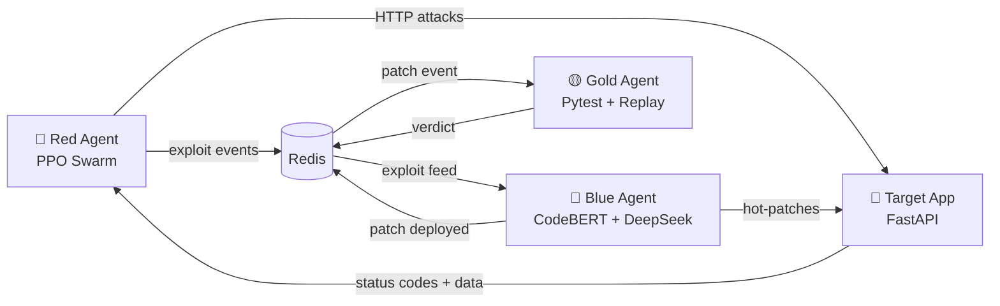

# 🛡️ Code-Audit Zero: Autonomous Cyber Warfare Simulation

> **The First Self-Healing, Mathematically Proven Cyber-Range.**

**Code-Audit Zero** is a closed-loop autonomous cyber warfare platform where AI agents battle for control of a live financial application — no humans in the loop.

- 🔴 **Red Agent** — PPO-trained 4-agent swarm that learns multi-stage attack chains through reinforcement learning
- 🔵 **Blue Agent** — Detects vulnerabilities with fine-tuned **CodeBERT**, generates patches with fine-tuned **DeepSeek-Coder-7B**, proves correctness with **Z3 theorem proving**
- 🟡 **Gold Agent** — Validates every patch via regression tests and live exploit replay

---

## 🚀 Quick Start

### Prerequisites
- **Python 3.11+**
- **Redis** — `brew install redis`
- **Model weights** — CodeBERT detector checkpoint + DeepSeek-Coder-7B LoRA adapter (see `blue_agent/models/`)

### Installation

```bash
git clone https://github.com/your-repo/code-audit-zero.git
cd code-audit-zero
pip install -r requirements.txt
```

### Launch

```bash
# Full simulation — one terminal, color-coded output
python run_all.py

# Train Red Agent with custom step count
python run_all.py --red-steps 50000

# Solo Red Agent training (no defenders)
python run_all.py --no-blue --no-gold

# Deploy trained Red Agent in live attack mode
python run_all.py --mode attack
```

Press **Ctrl+C** to stop all agents.

---

## 🏗️ Architecture



| Component | Technology | Role |
| :--- | :--- | :--- |
| **Target App** | FastAPI | Vulnerable banking API (wallet, vault, user profiles) |
| **Red Agent** | PyTorch PPO + LSTM + ICM | 4-agent attack swarm with intrinsic curiosity |
| **Blue Agent** | CodeBERT + DeepSeek-7B (LoRA) + Z3 | Detection → Patch generation → Formal verification |
| **Gold Agent** | Pytest + Exploit Replay | Regression tests + attack replay validation |
| **Redis** | Pub/Sub + State Store | Inter-agent communication and persistence |

---

## 🔴 Red Agent — Reinforcement Learning Attacker

A **4-agent PPO swarm** with a shared LSTM backbone and Intrinsic Curiosity Module (ICM):

| Sub-Agent | Actions | Role |
|-----------|---------|------|
| **Scout** | 0–4 | Probes endpoints, discovers admin keys, steals credentials |
| **Exploiter** | 5–9 | Financial attacks: negative quantities, vault drains |
| **Escalator** | 10–14 | Privilege escalation using stolen tokens |
| **Persistence** | 15–19 | Stealth $1 micro-drains to evade detection |

**How it learns**: The agent receives raw HTTP responses (status codes, balance deltas) as a 20-dimensional observation vector and optimizes a shaped reward function via PPO. The ICM module provides exploration bonuses when Blue Agent patches known vulnerabilities, pushing Red to discover new attack paths instead of repeating blocked exploits.

---

## 🔵 Blue Agent — Fully Local AI Defense

No cloud APIs. The entire defense pipeline runs on-device:

1. **Detection** — Fine-tuned **Microsoft CodeBERT** classifies code into 6 vulnerability categories (SQL injection, integer overflow, negative quantity, privilege escalation, path traversal, clean)
2. **Patch Generation** — Fine-tuned **DeepSeek-Coder-7B** with Kaggle-trained LoRA adapter generates secure patches (4-bit quantized via BitsAndBytes for M-series Macs)
3. **Formal Verification** — **Microsoft Z3 Theorem Prover** mathematically proves the patch eliminates the vulnerability before deployment
4. **Credential Rotation** — Automatically rotates leaked secrets when patching privilege escalation exploits

---

## 🟡 Gold Agent — The Judge

After Blue deploys a patch, Gold runs two validation steps:
1. **Regression tests** (Pytest) — ensures the app still works for legitimate users
2. **Exploit replay** — re-fires Red's last successful attack; if it still works, the patch fails

Verdicts are published to Redis for real-time dashboard visibility.

---

## 🔄 The Arms Race Loop

```
Red discovers /users/3 leaks admin key → drains vault
  → Blue detects (CodeBERT) → patches (DeepSeek-7B) → proves fix (Z3)
    → Gold verifies: regression pass + exploit blocked → PASS
      → Red hits 403 → ICM curiosity kicks in → discovers /buy negative quantity exploit
        → Cycle repeats with escalating sophistication
```

---

## 📂 Project Structure

```
code-audit-zero/
├── run_all.py                  # 🚀 Launch all agents (one terminal)
├── requirements.txt
│
├── red_agent/                  # 🔴 PPO Attack Swarm
│   ├── environment.py          #    Gymnasium env (20 actions → HTTP requests)
│   ├── models.py               #    RedAgentSwarm (LSTM + 4 heads) + ICM
│   ├── trainer.py              #    PPO trainer (GAE, rollouts, checkpoints)
│   ├── orchestrator.py         #    Live attack mode orchestrator
│   └── train.py                #    CLI entry point (train / attack)
│
├── blue_agent/                 # 🔵 Autonomous Defender
│   ├── patcher.py              #    Defense pipeline: detect → patch → verify → deploy
│   ├── detector_inference.py   #    CodeBERT vulnerability classifier
│   └── patcher_inference.py    #    DeepSeek-Coder-7B patch generator (LoRA + 4-bit)
│
├── gold_agent/                 # 🟡 The Judge
│   ├── judge.py                #    Regression tests + exploit replay
│   └── tests/                  #    Functional test suite
│
├── target_app/                 # 🏦 Vulnerable Banking API
│   └── main.py                 #    FastAPI (wallet, vault, users, admin)
│
├── shared/                     # 🔧 Shared Infrastructure
│   ├── config.py               #    Settings + logging
│   ├── redis_client.py         #    Redis pub/sub helpers
│   ├── formal_prover.py        #    Z3 theorem prover
│   └── schemas.py              #    Pydantic models
│
├── frontend/                   # 🖥️ React Dashboard (Vite)
├── dashboard.py                # 📊 Streamlit Dashboard
└── dashboard_api/              # 📡 Dashboard REST API
```

---

## 🛠️ Tech Stack

| Layer | Technology |
|-------|-----------|
| **RL Training** | PyTorch 2.x, Gymnasium, PPO, GAE, ICM |
| **Vulnerability Detection** | Microsoft CodeBERT (fine-tuned, RoBERTa) |
| **Patch Generation** | DeepSeek-Coder-7B-Instruct + LoRA (4-bit NF4) |
| **Formal Verification** | Microsoft Z3 Theorem Prover |
| **Target Application** | FastAPI, Uvicorn |
| **Communication** | Redis Pub/Sub |
| **Frontend** | React (Vite), Streamlit |
| **Hardware** | Apple Silicon MPS acceleration (M-series) |
